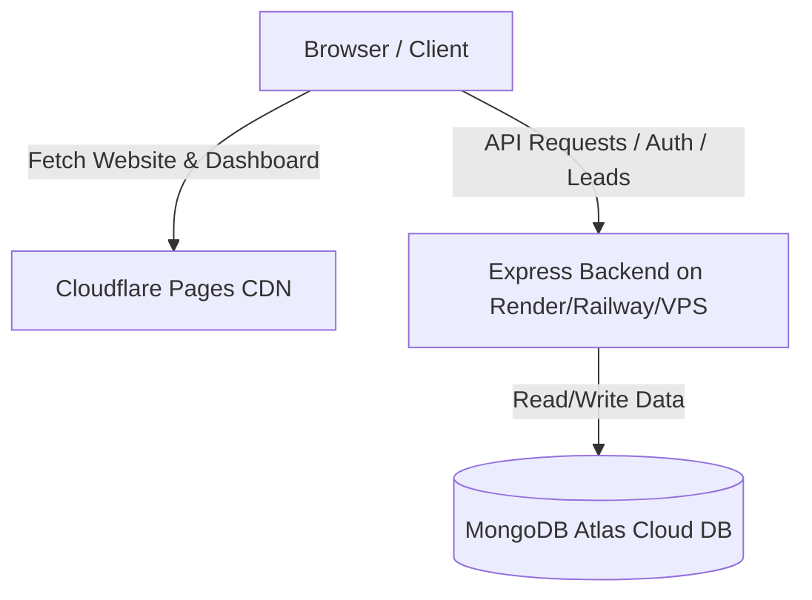

# Deployment Guide: Balaji & Co Web Application

This document provides step-by-step instructions for deploying the unified `balaji-app` (Marketing Website + Admin/Employee Dashboard + Node/Express Backend) to production using **Cloudflare Pages** and **MongoDB Atlas**.

---

## Architecture Overview



---

## Phase 1: Initialize Git Repository

Since the codebase is currently a local folder, you must initialize Git, commit the code, and push it to a remote repository (such as GitHub, GitLab, or Bitbucket) to connect it to cloud deployment providers.

Run the following commands in the root `balaji-app` directory:

```bash
# Initialize git
git init

# Create a standard .gitignore (if not already present)
# Ensure node_modules, .next, dist, out, and .env.local are excluded

# Add all files
git add .

# Commit changes
git commit -m "initial commit: unified marketing website and dashboard"

# Create a repository on GitHub, then link and push:
git remote add origin https://github.com/YOUR_USERNAME/balaji-app.git
git branch -M main
git push -u origin main
```

---

## Phase 2: Database Setup (MongoDB Atlas)

1. Sign up or log in to [MongoDB Atlas](https://www.mongodb.com/products/platform/atlas-database).
2. Create a free **M0 Cluster** in your preferred region.
3. **Database Access:** Create a database user (e.g., `balaji_user`) with a strong password. Grant the user **Read and write to any database** privilege.
4. **Network Access:** Add an IP entry. Since your backend hosting provider will use dynamic IPs, add `0.0.0.0/0` (allow access from anywhere).
5. **Get Connection String:**
   * Click **Connect** -> **Drivers**.
   * Copy the connection string. It will look like this:
     ```text
     mongodb+srv://balaji_user:<password>@cluster0.xxxx.mongodb.net/balaji?retryWrites=true&w=majority&appName=Cluster0
     ```
   * Replace `<password>` with the password you set for the user.

---

## Phase 3: Backend Deployment (Node/Express API)

You can deploy the backend to any cloud hosting provider that supports Node.js or Docker (such as **Render**, **Railway**, or a **VPS**). Since the `backend` folder contains a optimized `Dockerfile`, a Docker-based deployment is highly recommended.

### Option A: Render (Web Service)
1. Log in to [Render Dashboard](https://dashboard.render.com/).
2. Click **New +** -> **Web Service**.
3. Connect your GitHub repository.
4. Set the following details:
   * **Name:** `balaji-backend`
   * **Region:** Same region as your MongoDB Atlas cluster.
   * **Root Directory:** `backend` (Crucial: points to the backend sub-folder)
   * **Runtime:** `Docker` (Render will automatically detect and build the `Dockerfile` inside `backend/`)
5. Under **Environment Variables**, add the following keys:
   * `NODE_ENV`: `production`
   * `PORT`: `3000`
   * `MONGODB_URI`: *Your MongoDB Atlas connection string*
   * `JWT_SECRET`: *A secure random string (minimum 32 characters)*
   * `SEED_ADMIN_PASSWORD`: *A secure password (minimum 8 characters) for seeding default users*
   * `CORS_ORIGINS`: `https://balaji-app.pages.dev` (replace with your custom Cloudflare domain later)
6. Click **Create Web Service**. Once built, copy the service URL (e.g., `https://balaji-backend.onrender.com`).

### Option B: Railway
1. Log in to [Railway](https://railway.app/).
2. Click **New Project** -> **Deploy from GitHub repo**.
3. Select your repository.
4. Click **Go to settings** and set the **Root Directory** to `/backend`.
5. Under **Variables**, add the same environment variables as above (`MONGODB_URI`, `JWT_SECRET`, `NODE_ENV`, `PORT=3000`, `CORS_ORIGINS`, `SEED_ADMIN_PASSWORD`).
6. Click **Deploy**. Copy the generated public URL.

---

## Phase 4: Production Database Seeding

Once the backend is live and connected to MongoDB Atlas, you must run the database seed script to populate the initial pages content, demo showcase projects, and default users.

### Run Seeding Remotely (Recommended)
You can run the seed script from your local machine, pointing directly to the live MongoDB Atlas database.

1. Open your terminal in `balaji-app/backend/`.
2. Temporarily set your environment variables locally to point to Atlas:
   ```bash
   export MONGODB_URI="mongodb+srv://balaji_user:<password>@cluster0.xxxx.mongodb.net/balaji?retryWrites=true&w=majority"
   export SEED_ADMIN_PASSWORD="production_admin_password_here"
   ```
3. Run the seed command:
   ```bash
   npm run seed
   ```
4. Verify you see:
   ```text
   Connected to mongodb+srv://...
   Admin user created: rahul@balaji-co.com
   Employee user created: employee@balaji-co.com
   ✅ PageContent seeded (home, solutions, contact)
   ✅ ShowcaseProjects seeded (4 Framer projects)
   ✅ Leads seeded (5 samples)
   ```

---

## Phase 5: Frontend Deployment (Cloudflare Pages)

We deploy the frontend as a statically exported Next.js site to Cloudflare Pages.

1. Log in to the [Cloudflare Dashboard](https://dash.cloudflare.com/).
2. Go to **Workers & Pages** -> **Create application** -> **Pages** -> **Connect to Git**.
3. Connect your GitHub account and select the `balaji-app` repository.
4. Click **Begin setup**.
5. Configure the Build settings:
   * **Project name:** `balaji-app`
   * **Production branch:** `main`
   * **Framework preset:** `Next.js (Static HTML Export)`
   * **Build command:** `npm run build`
   * **Build output directory:** `out`
   * **Root directory:** *(Leave blank / root)*
6. Under **Environment variables (advanced)**, add:
   * **Variable name:** `NEXT_PUBLIC_API_URL`
   * **Value:** `https://your-backend-url.onrender.com/api` (the URL of your live Express backend deployed in Phase 3)
7. Click **Save and Deploy**. Cloudflare will build the site and deploy it.

---

## Phase 6: CORS Update on Backend

Once your Cloudflare Pages deployment is complete and you have your frontend URL (e.g., `https://balaji-app.pages.dev` or a custom domain):

1. Go to your Backend deployment dashboard (Render/Railway).
2. Update the `CORS_ORIGINS` environment variable to include your new production domain:
   ```text
   CORS_ORIGINS=https://balaji-app.pages.dev,https://yourcustomdomain.com
   ```
3. Save changes. The backend will redeploy automatically and allow secure API requests from your live website.

---

## Phase 7: Verification Checklist

1. **Visit Frontend:** Open `https://balaji-app.pages.dev` in your browser. Verify all marketing pages load correctly.
2. **Submit Contact Form:**
   * Go to `https://balaji-app.pages.dev/contact`.
   * Fill out and submit the form.
   * Verify you see a success message.
3. **Login to Dashboard:**
   * Go to `https://balaji-app.pages.dev/admin-login`.
   * Log in with `rahul@balaji-co.com` (and the `SEED_ADMIN_PASSWORD` you set).
   * Verify the Admin Dashboard loads.
   * Go to the **Leads** section and verify that your submitted contact form appears in the list.
4. **Employee Verification:**
   * Log out, and log in with `employee@balaji-co.com`.
   * Verify that the Employee view loads with correct permissions.
